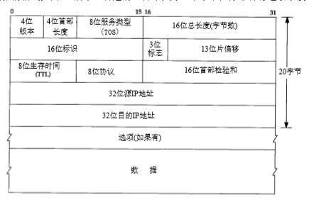
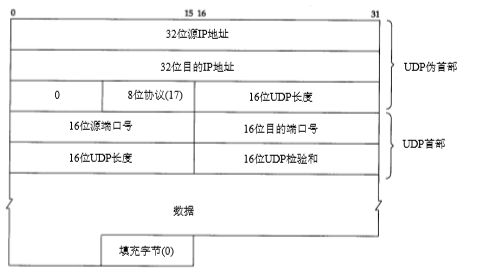

# 1. tcp格式

- [1. tcp格式](#1-tcp格式)
  - [1.1. 简介](#11-简介)
  - [1.2. tcp四元组](#12-tcp四元组)
  - [1.3. TCP的首部](#13-tcp的首部)
    - [1.3.1. 32位序号](#131-32位序号)
    - [1.3.2. 4位首部长度](#132-4位首部长度)
    - [1.3.3. 状态位](#133-状态位)
      - [1.3.3.1. RST复位报文段](#1331-rst复位报文段)
    - [1.3.4. 窗口大小](#134-窗口大小)
    - [1.3.5. 校验和](#135-校验和)
      - [1.3.5.1. IP首部校验和](#1351-ip首部校验和)
      - [1.3.5.2. TCP/UDP首部校验和](#1352-tcpudp首部校验和)
    - [1.3.6. 紧急指针](#136-紧急指针)
    - [1.3.7. 选项](#137-选项)
      - [1.3.7.1. NOP(NO-Operation)](#1371-nopno-operation)
      - [1.3.7.2. MSS(Maximum Segment Size)](#1372-mssmaximum-segment-size)
      - [1.3.7.3. WS(Windows Scale)](#1373-wswindows-scale)
      - [1.3.7.4. SACK_PERM(SACK Permitted)](#1374-sack_permsack-permitted)
      - [1.3.7.5. timestamps](#1375-timestamps)
  - [1.4. 参考资料](#14-参考资料)

## 1.1. 简介

&emsp;&emsp;TCP 将用户数据打包构成报文段；它发送数据后启动一个定时器；另一端对收到的数据 进行确认，对失序的数据重新排序，丢弃重复数据； TCP 提供端到端的流量控制，并计算和 验证一个强制性的端到端检验和。 许多流行的应用程序如 Telnet、Rlogin、FTP 和 SMTP 都使用 TCP 。

TCP发送抓包

## 1.2. tcp四元组

&emsp;&emsp;每个 TCP 段都包含源端和目的端的端口号，用于寻找发端和收端应用进程。这两个值加 上 IP 首部中的源端 IP 地址和目的端 IP 地址唯一确定一个 TCP 连接。  
&emsp;&emsp;有时，一个 IP 地址和一个端口号也称为一个插口（ socket ）。这个术语出现在最早的 TCP  规范（ RFC793 ）中，后来它也作为表示伯克利版的编程接口。插口对（ socketpair ）(包含客户 IP 地址、客户端口号、服务器  IP 地址和服务器端口号的四元组 )可唯一确定互 联网络中每个 TCP 连接的双方

## 1.3. TCP的首部

&emsp;&emsp;TCP 数据被封装在一个 IP 数据报中，如下图所示(最高位在左边，记为0 bit；最低位在右边，记为31 bit)

IP数据报格式及首部中的各字段，如下图所示

TCP 首部的数据格式，如果不计任选字段，它通常是 20 个字节，如下图所示

上图中，保留(6位)状态为，目前只有三位保留，后三位分别用于 NS CWDR NS

### 1.3.1. 32位序号

- 序号用来标识从 TCP 发端向 TCP 收端发送的数据字节流，它表示在这个报文段中的的第一 个数据字节。
- 如果将字节流看作在两个应用程序间的单向流动，则 TCP 用序号对每个字节进行计数。  
- 序号是32 bit的无符号数，序号到达2^32－1后又从0开始。
- 当建立一个新的连接时， SYN 标志变1。序号字段包含由这个主机选择的该连接的初始序号 ISN （Initial Sequence Number）。该主机要发送数据的第一个字节序号为这个 ISN 加1，因为  SYN 标志消耗了一个序号。
- 确认序号包含发送确认的一端所期望收到的下一个序号。 因此，确认序号应当是上次已成功收到数据字节序号加 1。只有 ACK 标志（下面介绍）为 1 时 确认序号字段才有效。 发送 ACK 和 32 bit的确认序号无需任何代价，因此，我们看到一旦一个连接建立起来，这二个字段总是被设置
- TCP 为应用层提供全双工服务。这意味数据能在两个方向上独立地进行传输。因此，连接的每一端必须保持每个方向上的传输数据序号

### 1.3.2. 4位首部长度

&emsp;&emsp;首部长度给出首部中32 bit字的数目。需要这个值是因为任选字段的长度是可变的。这个字段占4 bit，因此 TCP 最多有 60(15*32/8)字节的首部。如果没有任选字段，正常的长度是 20 字节。

### 1.3.3. 状态位

- 在 TCP 首部中有6个标志比特。
  - ECE 此标志负责指示 TCP 对等点是否具有 ECN 能力。
  - CWR 拥塞窗口减少标志被发送主机用来指示它收到一个设置了ECE 标志的包。
  - NS 实验阶段，用于防止意外恶意隐藏数据包
  - URG  紧急指针（urgent pointer）有效。
  - ACK 确认序号有效。  
  - PSH 接收方应该尽快将这个报文段交给应用层。
  - RST 重建连接。
  - SYN 同步序号用来发起一个连接。
  - FIN 发端完成发送任务。

&emsp;&emsp;RFC 1025 [Postel 1987], “TCP and IP Bake Off”，将一种报文段称为 Kamikaze 分组，在这样的报文段中有最大数量的标志比特同时被置为1（SYN, URG, PSH, FIN和1字节的 数据）。这样的报文段也叫作nastygram, 圣诞树分组，灯测试报文段(lamp test segment)。

#### 1.3.3.1. RST复位报文段

&emsp;&emsp;一般说来，无论何时一个报文 段发往基准的连接（ referenced connection）出现错误， TCP 都会发出一个复位报文段（这里 提到的“基准的连接”是指由目的  IP 地址和目的端口号以及源 IP 地址和源端口号指明的连接。

- 产生RST报文情况
  - 是当连接请求到达时，目的端口没有进程正在监听(IP需要可达)
  - 异常终止一个连接，Socket API通过“linger on close”选项 （SO_LINGER）提供了这种异常关闭的能力(丢弃任何待发数据)。终止一个连接的正常方式是一方发送 FIN 。有时这也称为有序释放 （orderly release），因为在所有排队数据都已发送之后才发送  FIN ，正常情况下没有任何数据丢失。
  - 向已经关闭的对方发送数据，对方会回复RST(半关闭状态)

&emsp;&emsp;如果一方已经关闭或异常终止连接而另一方却还不知道，我们将这样的 TCP 连接称为半 打开（Half-Open）的。任何一端的主机异常都可能导致发生这种情况。只要不打算在半打开连接上传输数据，仍处于连接状态的一方就不会检测另一方已经出现异常。

&emsp;&emsp;半打开连接的另一个常见原因是当客户主机突然掉电而不是正常的结束客户应用程序后 再关机。这可能发生在使用 P C机作为 Telnet 的客户主机上，例如，用户在一天工作结束时关 闭P C机的电源。当关闭P C机电源时，如果已不再有要向服务器发送的数据，服务器将永远不 知道客户程序已经消失了。当用户在第二天到来时，打开 P C机，并启动新的 Telnet 客户程序， 在服务器主机上会启动一个新的服务器程序。这样会导致服务器主机中产生许多半打开的 TCP 连接（在第2 3章中我们将看到使用 TCP 的 keepalive 选项能使 TCP 的一端发现另一端已经消 失）。

### 1.3.4. 窗口大小

&emsp;&emsp;TCP 的流量控制由连接的每一端通过声明的窗口大小来提供。窗口大小为字节数,窗口大小是一个 16 bit字段, 因而窗口大小最大为 65535(2^16) 字节

### 1.3.5. 校验和

&emsp;&emsp;检验和覆盖了整个的 TCP 报文段： TCP 首部和 TCP 数据。这是一个强制性的字段，一定是由发端计算和存储，并由收端进行验证。

#### 1.3.5.1. IP首部校验和

- 为了计算一份数据报的 IP 检验和，首先把检验和字段置为 0。
- 然后，对首部中每个 16 bit 进行二进制反码求和（整个首部看成是由一串 16 bit的字组成），结果存在检验和字段中。
- 当收到一份 IP 数据报后，同样对首部中每个 16 bit 进行二进制反码的求和。
- 由于接收方在计算过程中包含了发送方存在首部中的检验和，因此，如果首部在传输过程中没有发生任何差错， 那么接收方计算的结果应该为全1。如果结果不是全1（即检验和错误），那么 IP 就丢弃收到的数据报。但是不生成差错报文，由上层去发现丢失的数据报并进行重传。

#### 1.3.5.2. TCP/UDP首部校验和

- UDP 和 TCP 在首部中都有覆盖它们首部和数据的检验和。UDP 的检验和是可选的，而 TCP  的检验和是必需的。
- UDP数据报的长度可以为 奇数字节，但是检验和算法是把若干个 16 bit字相加。解决方法是必要时在最后增加填充字节 0，这只是为了检验和的计算（也就是说，可能增加的填充字节不被传送）
- UDP 数据报和 TCP 段都包含一个1 2字节长的伪首部，它是为了计算检验和而设置 的。伪首部包含 IP 首部一些字段。其目的是让 UDP 两次检查数据是否已经正确到达目的地 （例如，IP 没有接受地址不是本主机的数据报，以及 IP 没有把应传给另一高层的数据报传给 UDP）。UDP 数据报中的伪首部格式如图(TCP类似)。

### 1.3.6. 紧急指针

&emsp;&emsp;只有当 URG 标志置1时紧急指针才有效。紧急指针是一个正的偏移量，和序号字段中的值相加表示紧急数据最后一个字节的序号。 TCP 的紧急方式是发送端向另一端发送紧急数据的一种方式

&emsp;&emsp;对于紧急指针是指向紧急数据的最后一个字节还是指向紧急数据最后一个字节的下一个字节的争论。最初的 TCP 规范给出了两种解释，但Host Requirements RFC确定指向最后一个字节是正确的。然而，问题在于大多数的实现（包括源自伯克利的实现）继续使用错误的解释。

&emsp;&emsp;所有符合Host Requirements RFC的实现都是可兼容的，但很有可能无法与其他大多数主机正确通信。所以紧急指针很少用。

### 1.3.7. 选项

    Kind 类型(一个字节)，共支持 256 种类型
    Length 长度(一个字节)，最大 256 字节
    Data 内容(0~254字节)

&emsp;&emsp;每个选项的开始是1字节 kind 字段，说明选项的类型。 kind 字段为0和1的选项仅占1个字节。 其他的选项在 kind 字节后还有 len 字节。它说明的长度是指总长度，包括  kind 字节和 len 字节。

| Kind | Length | Data          | 说明                    |
| ---- | ------ | ------------- | ----------------------- |
| 0    | 无     | 无            | 选项表结束              |
| 1    | 无     | 无            | 无操作                  |
| 2    | 4      | 2bytes        | 最大报文段长度          |
| 3    | 3      | 1bytes        | 移位数,窗口扩大因子     |
| 4    | 2      | 无            | SACK                    |
| 5    |        |               |                         |
| 6    |        |               |                         |
| 7    |        |               |                         |
| 8    | 10     | 4bytes+4bytes | 时间戳值+时间戳回显应答 |
| 11   |        |               | tcp事务相关             |
| 12   |        |               | tcp事务相关             |
| 13   |        |               | tcp事务相关             |

#### 1.3.7.1. NOP(NO-Operation)

- Kind = 1
- 无length
- 无Data

占位符(1字节),一般为了保证扩展选项大小是4字节的倍数

#### 1.3.7.2. MSS(Maximum Segment Size)

- Kind = 2
- Length = 4
- Data 所能接收的最大长度报文

&emsp;&emsp;每个连接方通常都在通信的第一个报文段（为建立连接而设置  SYN 标志的那个段）中指明这个选项。它指明本端所能接收的最大长度的报文段。

&emsp;&emsp;在有些书中，将它看作可“协商”选项。它并不是任何条件下都可协商。当建立一个连 接时，每一方都有用于通告它期望接收的  MSS 选项（ MSS 选项只能出现在 SYN 报文段中）。如 果一方不接收来自另一方的 MSS 值，则 MSS 就定为默认值 536 字节

#### 1.3.7.3. WS(Windows Scale)

- Kind = 3
- Length = 3
- Data 窗口比例

比如Data是8，则2^8=256,比如windows size大小为513，则实际窗口大小为513*256

#### 1.3.7.4. SACK_PERM(SACK Permitted)

- Kind = 4
- Length = 2
- 无Data

是否支持SACK机制，具体详见超时重传

#### 1.3.7.5. timestamps

- Kind = 8
- Length =10
- Data 对方时间戳+回显时间戳

通过回显时间戳可以计算数据传输过程的RTT

## 1.4. 参考资料

1. [tcp传输控制协议](./../TCP-IP详解卷1/017.PDF)
