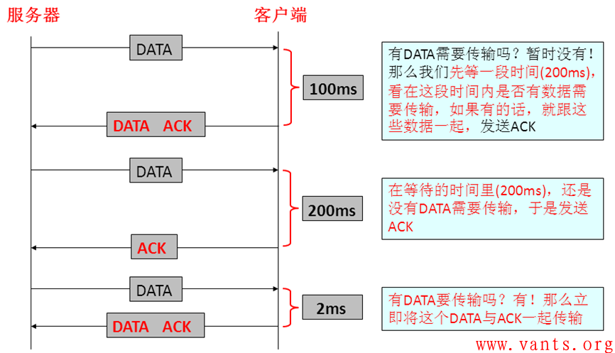

# 1. tcp的数据交互

- [1. tcp的数据交互](#1-tcp的数据交互)
  - [1.1. 简介](#11-简介)
  - [1.2. tcp交互数据流](#12-tcp交互数据流)
    - [1.2.1. 糊涂窗口综合征（SWS）](#121-糊涂窗口综合征sws)
    - [1.2.2. 经受时延的确认](#122-经受时延的确认)
    - [1.2.3. Nagle算法](#123-nagle算法)
    - [1.2.4. Cork算法](#124-cork算法)
    - [1.2.5. Nagle算法与CORK算法区别](#125-nagle算法与cork算法区别)
  - [1.3. tcp成块数据流](#13-tcp成块数据流)
    - [1.3.1. 滑动窗口](#131-滑动窗口)
    - [1.3.2. PUSH标志](#132-push标志)
    - [1.3.4. 吞吐量](#134-吞吐量)
  - [1.4. 参考资料](#14-参考资料)

## 1.1. 简介

&emsp;&emsp;前一章我们介绍了 TCP 连接的建立与释放，现在来介绍使用 TCP 进行数据传输的有关问题。

&emsp;&emsp;一些有关 TCP 通信量的研究如[Caceres et al. 1991]发现，如果按照分组数量计算，约有一半的 TCP 报文段包含成块数据（如 FTP 、电子邮件和 Usenet新闻），另一半则包含交互数据 （如 Telnet 和 Rlogin ）。如果按字节计算，则成块数据与交互数据的比例约为 90% 和 10%。这是 因为成块数据的报文段基本上都是满长度（ full-sized ）的（通常为 512 字节的用户数据），而交互数据则小得多（上述研究表明 Telnet 和 Rlogin 分组中通常约 90% 左右的用户数据小于 10 个字节）。

## 1.2. tcp交互数据流

### 1.2.1. 糊涂窗口综合征（SWS）

1. 什么是糊涂窗口综合症（Silly Window Syndrome）
    当发送端应用进程产生数据很慢、或接收端应用进程处理接收缓冲区数据很慢，或二者兼而有之；就会使应用进程间传送的报文段很小，特别是有效载荷很小。极端情况下，有效载荷可能只有1个字节；而传输开销有40字节(20字节的IP头+20字节的TCP头) 这种现象就叫糊涂窗口综合症。

2. 造成糊涂窗口综合征的原因

   - **发送端引起的SWS**

        如果发送端为产生数据很慢的应用程序服务(典型的有telnet应用)，例如，一次产生一个字节。这个应用程序一次将一个字节的数据写入发送端的TCP的缓存。如果发送端的TCP没有特定的指令，它就产生只包括一个字节数据的报文段。结果有很多41字节的IP数据报就在互连网中传来传去。解决的方法是防止发送端的TCP逐个字节地发送数据。必须强迫发送端的TCP收集数据，然后用一个更大的数据块来发送。发送端的TCP要等待多长时间呢？如果它等待过长，它就会使整个的过程产生较长的时延。如果它的等待时间不够长，它就可能发送较小的报文段，于是，Nagle找到了一个很好的解决方法，发明了Nagle算法。而他选择的等待时间是一个RTT,即下个ACK来到时。

   - **接收端引起的SWS**

        接收端的TCP可能产生糊涂窗口综合症，如果它为消耗数据很慢的应用程序服务，例如，一次消耗一个字节。假定发送应用程序产生了1000字节的数据块，但接收应用程序每次只吸收1字节的数据。再假定接收端的TCP的输入缓存为4000字节。发送端先发送第一个4000字节的数据。接收端将它存储在其缓存中。现在缓存满了。它通知窗口大小为零，这表示发送端必须停止发送数据。接收应用程序从接收端的TCP的输入缓存中读取第一个字节的数据。在入缓存中现在有了1字节的空间。接收端的TCP宣布其窗口大小为1字节，这表示正渴望等待发送数据的发送端的TCP会把这个宣布当作一个好消息，并发送只包括一个字节数据的报文段。这样的过程一直继续下去。一个字节的数据被消耗掉，然后发送只包含一个字节数据的报文段。这个可以通过接受时延的确认来改善。

### 1.2.2. 经受时延的确认

通常TCP在接收到数据时并不立即发送ACK，相反，它推迟发送，以便将ACK与需要沿该方向发送的数据一起发送（有时称这种现象为数据捎带ACK），这样做的目的是尽量减少发往网络的报文，以提高传输的效率，节省网络资源。通过设置 TCP_QUICKACK 来关闭经受时延的确认。TCP_QUICKACK 选项是需要在每次调用recv后重新设置的。

### 1.2.3. Nagle算法

&emsp;&emsp; RFC896 [Nagle 1984]中所建议的 Nagle 算法，默认是开启的

&emsp;&emsp;该算法要求一个 TCP 连接上最多只能有一个未被确认的未完成的小分组，在该分组的确认到达之前不能发送其他的小分组。相反， TCP 收集这些少量的分组，并在确认到来时以一个分组的方式发出去。该算法的优越之处在于它是自适应的：确认到达得越快，数据也就发送得越快。而在希望减少微小分组数目的低速广域网上，则会发送更少的分组.

&emsp;&emsp;插口API用户可以使用 TCP_NODELAY 选项来关闭Nagle算法。 Host Requirements RFC 声明 TCP 必须实现 Nagle 算法，但必须为应用提供一种方法来关闭该算法在某个连接上执行。

- Nagle发送规则
  - 如果包长度达到MSS，则允许发送；
  - 如果该包含有FIN，则允许发送；
  - 设置了TCP_NODELAY选项，则允许发送；
  - 若所有发出去的小数据包（包长度小于MSS）均被确认，则允许发送；（前提是未设置TCP_CORK选项，和Nagle隐式地不发小包不同，TCP_CORK是显式地阻止小包发送）
  - 上述条件都未满足，但发生了超时（一般为200ms），则立即发送。

### 1.2.4. Cork算法

&emsp;&emsp;这个算法比Nagle算法更激进一些，干脆直接计算出一个值，当发送方的滑动窗口大小小于这个值的时候，不进行数据包的发送。这样这个算法就能有效直接杜绝小包的出现了。当然可能会导致数据有一定的延迟性了。设置该选项后，内核会尽力把小数据包拼接成一个大的数据包（一个MTU）再发送出去，当然若一定时间后（一般为200ms，该值尚待确认），内核仍然没有组合成一个MTU时也必须发送现有的数据

&emsp;&emsp;然而，TCP_CORK的实现可能并不像你想象的那么完美，CORK并不会将连接完全塞住。内核其实并不知道应用层到底什么时候会发送第二批数据用于和第一批数据拼接以达到MTU的大小，因此内核会给出一个时间限制，在该时间内没有拼接成一个大包（努力接近MTU）的话，内核就会无条件发送。也就是说若应用层程序发送小包数据的间隔不够短时，TCP_CORK就没有一点作用，反而失去了数据的实时性（每个小包数据都会延时一定时间再发送）。

### 1.2.5. Nagle算法与CORK算法区别

&emsp;&emsp;Nagle算法和CORK算法非常类似，但是它们的着眼点不一样，Nagle算法主要避免网络因为太多的小包（协议头的比例非常之大）而拥塞，而CORK算法则是为了提高网络的利用率，使得总体上协议头占用的比例尽可能的小。如此看来这二者在避免发送小包上是一致的，在用户控制的层面上，Nagle算法完全不受用户socket的控制，你只能简单的设置TCP_NODELAY而禁用它，CORK算法同样也是通过设置或者清除TCP_CORK使能或者禁用之，然而Nagle算法关心的是网络拥塞问题，只要所有的ACK回来则发包，而CORK算法却可以关心内容，在前后数据包发送间隔很短的前提下（很重要，否则内核会帮你将分散的包发出），即使你是分散发送多个小数据包，你也可以通过使能CORK算法将这些内容拼接在一个包内，如果此时用Nagle算法的话，则可能做不到这一点。

## 1.3. tcp成块数据流

### 1.3.1. 滑动窗口

下图用可视化的方法显示了我们在前一节观察到的滑动窗口协议

&emsp;&emsp;在这个图中，我们将字节从 1 至11 进行标号。接收方通告的窗口称为提出的窗口（ offered  window ），它覆盖了从第4字节到第9字节的区域，表明接收方已经确认了包括第 3 字节在内的数据，且通告窗口大小为6。我们知道窗口大小是与确认序号相对应的。发送方计算它的可用窗口，该窗口表明多少数据可以立即被发送。

&emsp;&emsp;当接收方确认数据后，这个滑动窗口不时地向右移动。窗口两个边沿的相对运动增加或减少了窗口的大小。

- 我们使用三个术语来描述窗口左右边沿的运动
  - 称窗口左边沿向右边沿靠近为窗口合拢。这种现象发生在数据被发送和确认时。
  - 当窗口右边沿向右移动时将允许发送更多的数据，我们称之为窗口张开。这种现象发生在另一端的接收进程读取已经确认的数据并释放了 TCP 的接收缓存时。
  - 当右边沿向左移动时，我们称之为窗口收缩。 Host Requirements RFC 强烈建议不要使用这种方式。但 TCP 必须能够在某一端产生这种情况时进行处理。

    

- 因为窗口的左边沿受另一端发送的确认序号的控制，因此不可能向左边移动。如果接收到一个指示窗口左边沿向 左移动的 ACK ，则它被认为是一个重复 ACK ， 并被丢弃。
- 如果左边沿到达右边沿，则称其为一个零窗口，此时发送方不能够发送任何数据
- 发送方不必发送一个全窗口大小的数据。
- 来自接收方的一个报文段确认数据并把窗口向右边滑动。这是因为窗口的大小是相对 于确认序号的。
- 接收方在发送一个 ACK 前不必等待窗口被填满

### 1.3.2. PUSH标志

&emsp;&emsp;发送方使用 该标志通知接收方将所收到的数据全部提交给接收进程。这里的数据包括与 PUSH 一起传送的数据以及接收方 TCP 已经为接收进程收到的其他数据。

&emsp;&emsp;在最初的 TCP 规范中，一般假定编程接口允许发送进程告诉它的 TCP 何时设置 PUSH 标志。通过允许客户应用程序通知其 TCP 设置 PUSH 标志，客户进程通知 TCP 在向服务器发送一个报文段时不要因等待额外数据而使已提交数据在缓存中滞留。类似地，当服务器的 TCP 接收到一个设置了 PUSH 标志的报文段时，它需要立即将这些数据递交给服务器进程而不能等待判断是否还会有额外的数据到达。

&emsp;&emsp;目前大多数的 API 没有向应用程序提供通知其 TCP 设置 PUSH 标志的方法。的确， 许多实现程序认为 PUSH 标志已经过时，一个好的 TCP 实现能够自行决定何时设置这个标志。如果待发送数据将清空发送缓存，则大多数的源于伯克利的实现能够自动设置  PUSH 标志。 这意味着我们能够观察到每个应用程序写的数据均被设置了  PUSH 标志，因为数据在写的时候就立即被发送。

### 1.3.4. 吞吐量

&emsp;&emsp;TCP窗口大小(bits) = 每秒吞吐量(bits/s) * 时延RTT(秒), 一般称之为带宽时延乘积,这个值依赖于网络速度和两端的 RTT，可以有很大的变动

&emsp;&emsp;比如在一个稳定的局域网，通过通吐量和时间(一般相对稳定)，就可以计算出TCP需要设置的windos窗口。

## 1.4. 参考资料

1. [tcp交互数据流](../TCP-IP详解卷1/019.PDF)
2. [tcp成块数据流](../TCP-IP详解卷1/020.PDF)
