- [1. windows性能监控工具](#1-windows%e6%80%a7%e8%83%bd%e7%9b%91%e6%8e%a7%e5%b7%a5%e5%85%b7)
  - [1.1. 概述](#11-%e6%a6%82%e8%bf%b0)
  - [1.2. 常用性能指标](#12-%e5%b8%b8%e7%94%a8%e6%80%a7%e8%83%bd%e6%8c%87%e6%a0%87)
  - [1.3. 问题记录](#13-%e9%97%ae%e9%a2%98%e8%ae%b0%e5%bd%95)
    - [1.3.1. 如何监控某一个程序性能(注意这里监控的是真实数据)](#131-%e5%a6%82%e4%bd%95%e7%9b%91%e6%8e%a7%e6%9f%90%e4%b8%80%e4%b8%aa%e7%a8%8b%e5%ba%8f%e6%80%a7%e8%83%bd%e6%b3%a8%e6%84%8f%e8%bf%99%e9%87%8c%e7%9b%91%e6%8e%a7%e7%9a%84%e6%98%af%e7%9c%9f%e5%ae%9e%e6%95%b0%e6%8d%ae)
    - [1.3.2. 如何查看监控数据](#132-%e5%a6%82%e4%bd%95%e6%9f%a5%e7%9c%8b%e7%9b%91%e6%8e%a7%e6%95%b0%e6%8d%ae)
    - [1.3.3. 如何监控整个系统cpu,memory,network,disk(注意这里的数据是百分比)](#133-%e5%a6%82%e4%bd%95%e7%9b%91%e6%8e%a7%e6%95%b4%e4%b8%aa%e7%b3%bb%e7%bb%9fcpumemorynetworkdisk%e6%b3%a8%e6%84%8f%e8%bf%99%e9%87%8c%e7%9a%84%e6%95%b0%e6%8d%ae%e6%98%af%e7%99%be%e5%88%86%e6%af%94)
    - [1.3.4. 为什么监控某个进程参数时,实时展示占用百分比不正常](#134-%e4%b8%ba%e4%bb%80%e4%b9%88%e7%9b%91%e6%8e%a7%e6%9f%90%e4%b8%aa%e8%bf%9b%e7%a8%8b%e5%8f%82%e6%95%b0%e6%97%b6%e5%ae%9e%e6%97%b6%e5%b1%95%e7%a4%ba%e5%8d%a0%e7%94%a8%e7%99%be%e5%88%86%e6%af%94%e4%b8%8d%e6%ad%a3%e5%b8%b8)
    - [1.3.5. 单个进程的mem如何查看其占用百分比](#135-%e5%8d%95%e4%b8%aa%e8%bf%9b%e7%a8%8b%e7%9a%84mem%e5%a6%82%e4%bd%95%e6%9f%a5%e7%9c%8b%e5%85%b6%e5%8d%a0%e7%94%a8%e7%99%be%e5%88%86%e6%af%94)
    - [1.3.6. 如何实时监控数据走势](#136-%e5%a6%82%e4%bd%95%e5%ae%9e%e6%97%b6%e7%9b%91%e6%8e%a7%e6%95%b0%e6%8d%ae%e8%b5%b0%e5%8a%bf)
  - [1.4. 名称解释](#14-%e5%90%8d%e7%a7%b0%e8%a7%a3%e9%87%8a)
  - [1.5. 参考资料](#15-%e5%8f%82%e8%80%83%e8%b5%84%e6%96%99)

# 1. windows性能监控工具

## 1.1. 概述

Perfmon是windows自带工具, 无需安装, 键入命令即可打开工具

## 1.2. 常用性能指标

| 性能对象      | 计数器                    | 提供的信息                                                                                 |
| ------------- | ------------------------- | ------------------------------------------------------------------------------------------ |
| Processor     | % ldle Time               | 处理器在采样期间空闲时间的百分比                                                           |
| Processor     | % Processor Time          | 指处理器用来执行非闲置线程时间的百分比。（CPU占用率）                                      |
| Processor     | % User Time               | 处理器处于用户模式的时间百分比                                                             |
| Memory        | Available Bytes           | 显示出当前空闲的物理内存总量。                                                             |
| Memory        | % Committed Bytes In Use  | 内存使用百分比，[Compitted Bytes / Commit Limit]的比值                                     |
| Memory        | Page Faults/sec           | 指处理器处理错误页的综合速率，[错误页数/s]来计算                                           |
| Network       | Interface Bytes Total/sec | 发送和接收字节的速率，包括帧字符在内                                                       |
| Network       | Interface Packets/sec     | 发送和接收数据包的速率                                                                     |
| Physical Disk | % Busy Time               | 磁盘驱动器忙于为读or写入请求提供服务所用时间的百分比。  若该数值比较大，则硬盘有可能是瓶颈 |
| Physical Disk | Avg. Disk Queue Length    | 磁盘队列的平均长度。磁盘完成对读取和写入请求的处理时间，磁盘数据吞吐量的外在表现           |
| Physical Disk | Current Disk Queue Length | 在收集操作数据时，磁盘上未完成的请求数目                                                   |

## 1.3. 问题记录

### 1.3.1. 如何监控某一个程序性能(注意这里监控的是真实数据)

- windows+R(打开运行窗口)
- 输入perfmon(中文名称叫:性能监视器), 回车后即可打开工具
- 依次选择:性能--数据收集器--用户定义
- 用户定义右键选择新建--数据收集器
  - 数据收集器:填写名称, 选中手动创建, 点击下一步。
  - 创建数据日志, 选中性能计数器, 点击下一步。点击添加.
  - 从第一个下拉列表找到process点开右边小箭头, 先选中Working set
  - 从第二个下来列表里选中自己的进程名字, 点击添加。(同理从第一个列表中选择 % Processor Time, % User Time等,注意这里是实际大小,不是占用百分比)
- 创建完成后点击开始即可.
参考序列

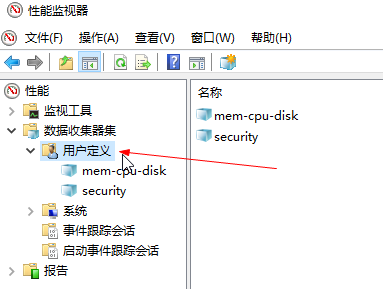

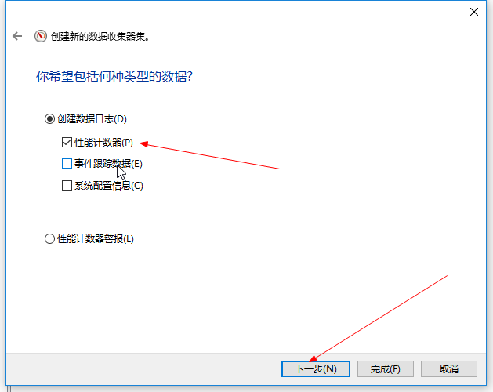
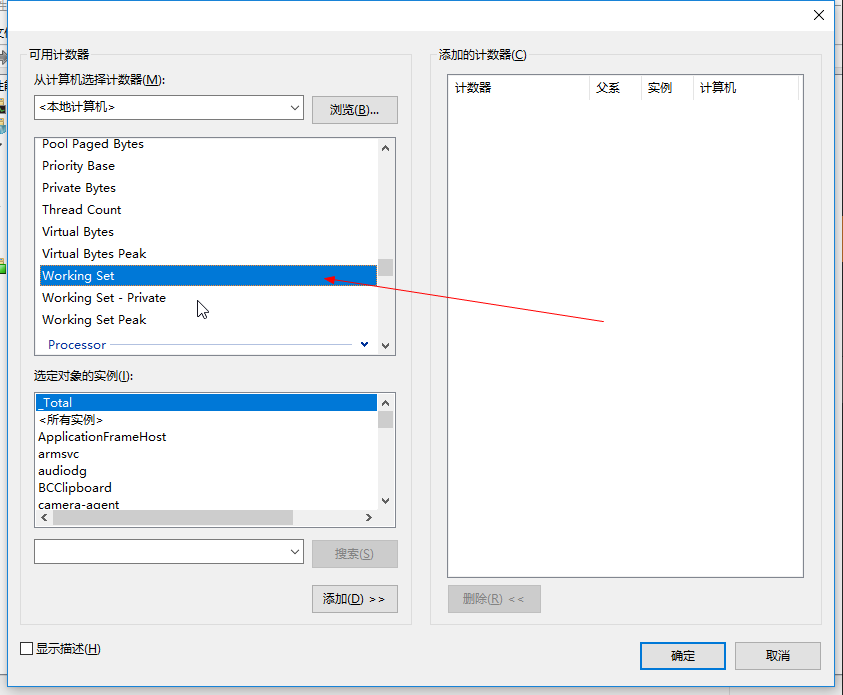
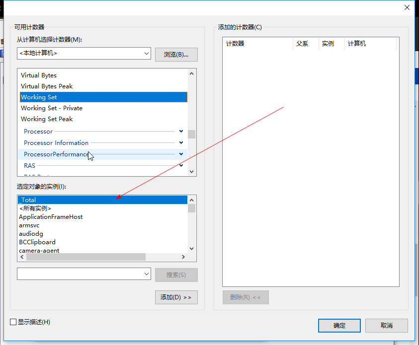
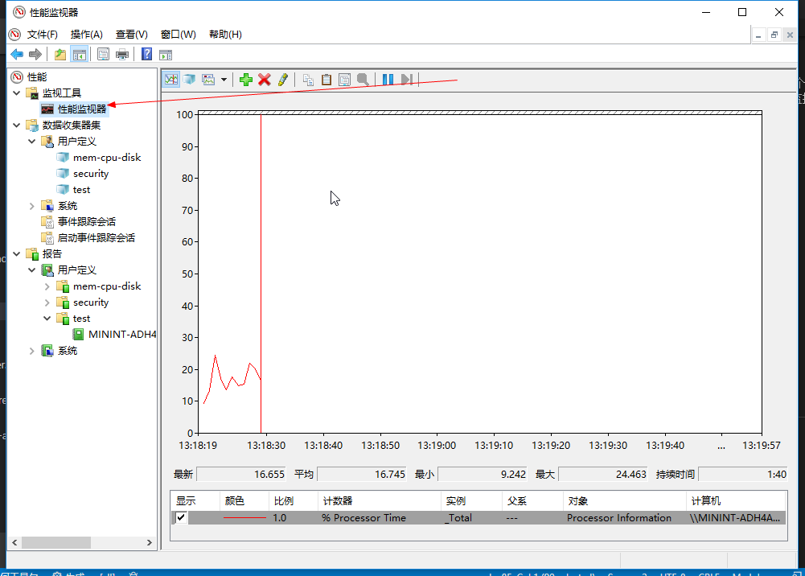
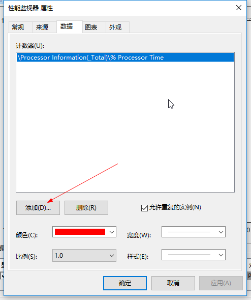
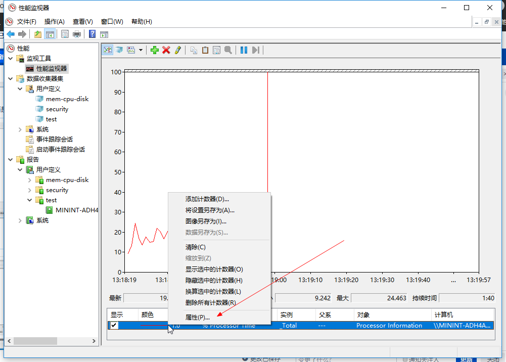
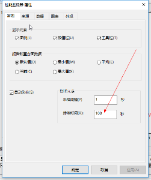
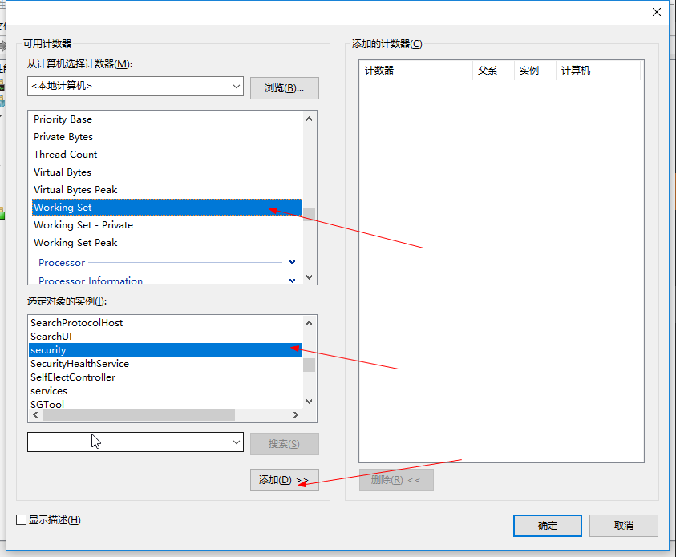

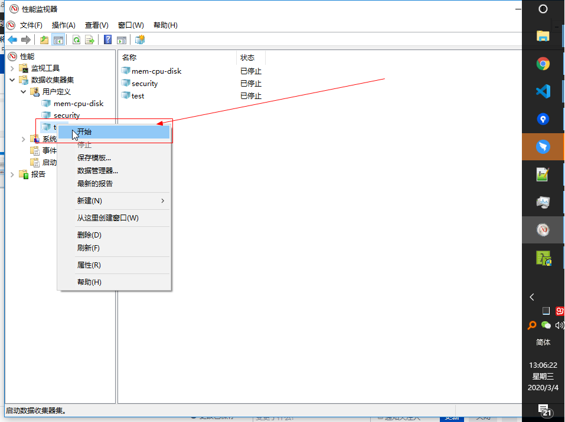
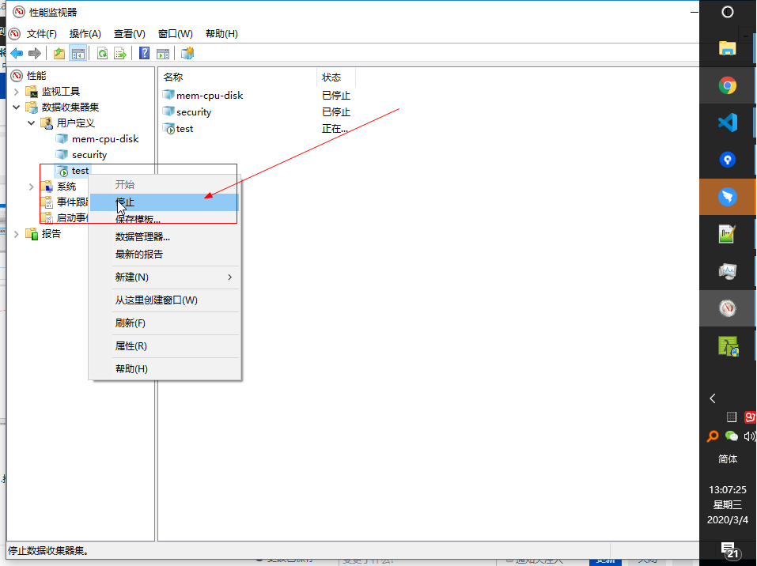
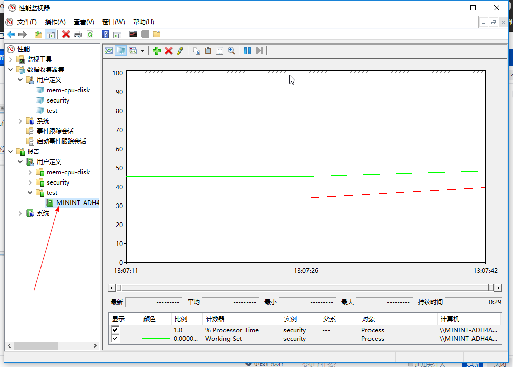

### 1.3.2. 如何查看监控数据

- 上边监控程序运行一段时间后点击停止,就可以了查看监控数据了.按照下边步骤查看,查看的时候注意有一列比例,可能会放大或缩小实际的值.
- 首先点击报告
- 其次点击用户定义
- 再点击上边创建的数据收集器
- 里边的数据就可以查看了.

### 1.3.3. 如何监控整个系统cpu,memory,network,disk(注意这里的数据是百分比)

- 同1,打开自定义数据收集器,只是选择的内容不一样.
- mem:第一列选择Memory,第二列选择% Committed Bytes In Use,点击添加
- cpu:第一列选择Processor,第二列选择% Processor Time,点击添加
- network:第一列选择Network Interface,第二列选择Bytes Total/sec,点击添加
- disk:第一列选择Physical Disk,第二列选择Idle Time(空闲率),点击添加

### 1.3.4. 为什么监控某个进程参数时,实时展示占用百分比不正常

答:因为监控某个进程时,监控的是实际使用数据,不是百分比.而监控系统的某个参数,比如内存,cpu等时,统计的是百分比,所以当放在同一个百分比坐标下的时候,单独监控进程的数据条一直在最上边.可以选中某一个进程的统计数据,右键选中"换算选中计算器"就可以把单个进程的监控数据显示在一个输出栏里,这里只能体现浮动,还是无法真实表示百分比.

### 1.3.5. 单个进程的mem如何查看其占用百分比

答:暂时无法办到

### 1.3.6. 如何实时监控数据走势

- 同1,打开资源管理器.
- 选中监控工具,里边有性能监视器,这里可以实时监控数据
- 实时显示数据在100s~1000s之间,可通过右键设置
- 其他参数设置参考上边问题

## 1.4. 名称解释

1. perfmon: 性能监视器
2. %Processor Time: 表示cpu的利用率, 可以看到最新值、平均值、最小和最大值, 以及监控持续时间

## 1.5. 参考资料

1. [Windows性能监控工具Perfmon使用指南](https://blog.csdn.net/weixin_34293059/article/details/91582958)  
2. [Windows Performance Monitor](https://docs.microsoft.com/en-us/previous-versions/windows/it-pro/windows-server-2008-R2-and-2008/cc749249(v=ws.11))
3. [./memory.md](./memory.md)
4. [perfmon——使用windows系统自带的性能监视器监控进程信息](https://www.cnblogs.com/zhengna/p/9482538.html)
5. [Windows性能监控工具Perfmon的使用、性能指标分析](https://www.jianshu.com/p/f82c2b726ecf)