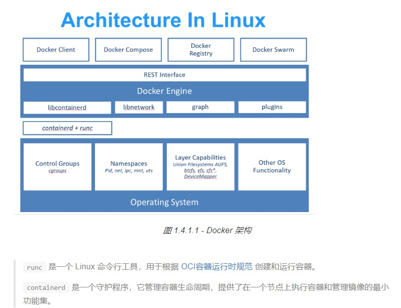

# 1. docker学习

- [1. docker学习](#1-docker学习)
  - [1.1. 简介](#11-简介)
  - [1.2. 名称解释](#12-名称解释)
    - [1.2.1. 镜像（Image）](#121-镜像image)
    - [1.2.2. 容器（Container）](#122-容器container)
    - [1.2.3. 仓库（Repository）](#123-仓库repository)
    - [1.2.4. 镜像加速器](#124-镜像加速器)
    - [1.2.5. 镜像构建上下文（Context）](#125-镜像构建上下文context)
    - [1.2.6. CentOS/RHEL 的用户需要注意的事项](#126-centosrhel-的用户需要注意的事项)
  - [1.3. 参考资料](#13-参考资料)

## 1.1. 简介

    Docker 最初是 dotCloud 公司创始人 Solomon Hykes 在法国期间发起的一个公司内部项目，它是基于 dotCloud 公司多年云服务技术的一次革新，并于 2013 年 3 月以 Apache 2.0 授权协议开源，主要项目代码在 GitHub 上进行维护。Docker 项目后来还加入了 Linux 基金会，并成立推动 开放容器联盟（OCI）。

## 1.2. 名称解释

### 1.2.1. 镜像（Image）

    Docker 镜像是一个特殊的文件系统，除了提供容器运行时所需的程序、库、资源、配置等文件外，还包含了一些为运行时准备的一些配置参数（如匿名卷、环境变量、用户等）。镜像不包含任何动态数据，其内容在构建之后也不会被改变。
    镜像的唯一标识是其 ID 和摘要，而一个镜像可以有多个标签。

### 1.2.2. 容器（Container）

    镜像（Image）和容器（Container）的关系，就像是面向对象程序设计中的 类 和 实例 一样，镜像是静态的定义，容器是镜像运行时的实体。容器可以被创建、启动、停止、删除、暂停等。

    容器的实质是进程，但与直接在宿主执行的进程不同，容器进程运行于属于自己的独立的 命名空间。因此容器可以拥有自己的 root 文件系统、自己的网络配置、自己的进程空间，甚至自己的用户 ID 空间。容器内的进程是运行在一个隔离的环境里，使用起来，就好像是在一个独立于宿主的系统下操作一样。这种特性使得容器封装的应用比直接在宿主运行更加安全。也因为这种隔离的特性，很多人初学 Docker 时常常会混淆容器和虚拟机。

### 1.2.3. 仓库（Repository）

    镜像构建完成后，可以很容易的在当前宿主机上运行，但是，如果需要在其它服务器上使用这个镜像，我们就需要一个集中的存储、分发镜像的服务，Docker Registry 就是这样的服务。

    一个 Docker Registry 中可以包含多个 仓库（Repository）；每个仓库可以包含多个 标签（Tag）；每个标签对应一个镜像。

### 1.2.4. 镜像加速器

- Azure 中国镜像<https://dockerhub.azk8s.cn>
- 阿里云加速器(需登录账号获取)
- 七牛云加速器<https://reg-mirror.qiniu.com>

### 1.2.5. 镜像构建上下文（Context）

[详见2019-10-22-dockerCommand.md的Build命令](2019-10-22-dockerCommand.md)

### 1.2.6. CentOS/RHEL 的用户需要注意的事项

    以下内容仅适用于 Docker CE 18.09 以下版本，在 Docker CE 18.09 版本中默认使用的是 overlay2 驱动。

    在 Ubuntu/Debian 上有 UnionFS 可以使用，如 aufs 或者 overlay2，而 CentOS 和 RHEL 的内核中没有相关驱动。因此对于这类系统，一般使用 devicemapper 驱动利用 LVM 的一些机制来模拟分层存储。这样的做法除了性能比较差外，稳定性一般也不好，而且配置相对复杂。Docker 安装在 CentOS/RHEL 上后，会默认选择 devicemapper，但是为了简化配置，其 devicemapper 是跑在一个稀疏文件模拟的块设备上，也被称为 loop-lvm。这样的选择是因为不需要额外配置就可以运行 Docker，这是自动配置唯一能做到的事情。但是 loop-lvm 的做法非常不好，其稳定性、性能更差，无论是日志还是 docker info 中都会看到警告信息。官方文档有明确的文章讲解了如何配置块设备给 devicemapper 驱动做存储层的做法，这类做法也被称为配置 direct-lvm。

    除了前面说到的问题外，devicemapper + loop-lvm 还有一个缺陷，因为它是稀疏文件，所以它会不断增长。用户在使用过程中会注意到 /var/lib/docker/devicemapper/devicemapper/data 不断增长，而且无法控制。很多人会希望删除镜像或者可以解决这个问题，结果发现效果并不明显。原因就是这个稀疏文件的空间释放后基本不进行垃圾回收的问题。因此往往会出现即使删除了文件内容，空间却无法回收，随着使用这个稀疏文件一直在不断增长。

    所以对于 CentOS/RHEL 的用户来说，在没有办法使用 UnionFS 的情况下，一定要配置 direct-lvm 给 devicemapper，无论是为了性能、稳定性还是空间利用率。

    或许有人注意到了 CentOS 7 中存在被 backports 回来的 overlay 驱动，不过 CentOS 里的这个驱动达不到生产环境使用的稳定程度，所以不推荐使用。

## 1.3. 参考资料

1. [Docker — 从入门到实践](https://docker_practice.gitee.io/zh-cn/)
